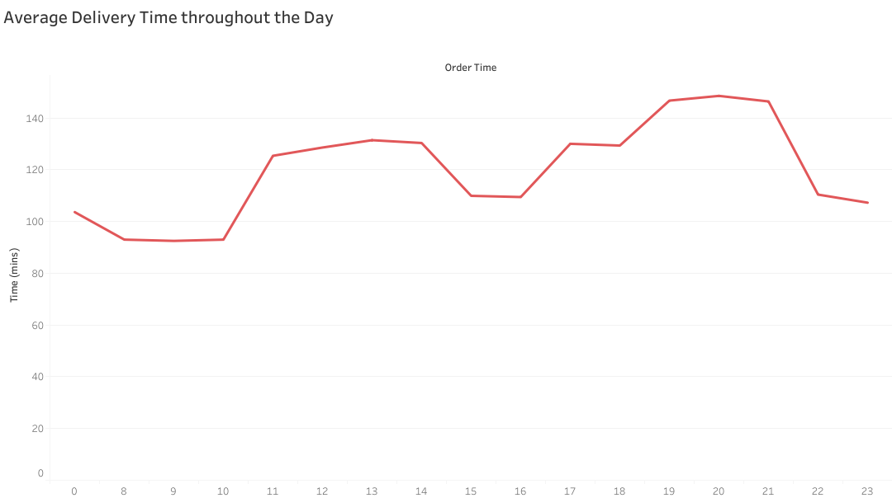

# Data Analysis Report

## Background and Overview
SwiftShip, a leading courier company specializing in door-to-door parcel deliveries, has accumulated a substantial volume of operational data. Leveraging this data, we conducted a detailed analysis to uncover actionable insights aimed at enhancing delivery efficiency, reducing operational costs  and improving customer satisfaction. Our study focused on identifying key factors influencing delivery times and exploring opportunities for optimization across various aspects of the company's operations. 

## Data Collection
I collected synthetic data from Kaggle that simulates real-world stores. I performed data cleaning and preprocessing using Python. For statistical analysis, I used Excel, and for visual analysis, I utilized Tableau.

## Executive Summary

SwiftShop has maintained excellent customer satisfaction with an average delivery rating of **4.65/5 stars**. However, the average delivery time of **129.4 minutes** for a **26.7 km** route leads to increased fuel consumption, raising operational costs. Reducing delivery times could help cut fuel costs, improve efficiency, and maintain high customer satisfaction.

A closer analysis of SwiftShip’s data uncovers several key factors influencing delivery times and overall operational efficiency

### Delivery Time depends on Traffic Congestation

Traffic is a significant factor impacting delivery times, with semi-urban areas experiencing the highest delays. Data indicates that there are no instances of low traffic in these areas. In fact, semi-urban delivery times average 286.6 minutes, nearly double the delivery times seen in metropolitan and urban areas. This highlights the opportunity to optimize routes in semi-urban regions to improve efficiency and reduce overall delivery time. 

### Hour of Day impacts Delivery time

The delivery time is influenced by the hour of the day, showing noticeable variation across different times. The shortest delivery times are typically observed between 8:00 AM and 10:59 AM, suggesting that deliveries made during this period are more efficient. However, delivery times reach their highest during the evening, specifically between 7:00 PM and 10:00 PM, indicating potential delays or inefficiencies during these hours.

### Weather-Related Challenges 
 Weather conditions significantly impact delivery times, with cloudy and foggy conditions leading to the longest delays. These weather patterns create visibility issues and slower driving conditions, resulting in slower deliveries. 

### Predictive Model for Delivery Time 

To optimize SwiftShip's operations, a predictive model was developed to forecast delivery times based on key factors such as traffic conditions, weather, and time of day. The model leverages historical data to make predictions, providing valuable insights into potential delays before they occur. 

## Recommendations

###  Optimize Routing with Real-Time Traffic Data

- **Implement traffic-aware routing systems**: Use real-time traffic data to avoid congested areas, especially in semi-urban regions where traffic bottlenecks tend to occur.
  
- **Use historical traffic patterns**: Leverage past traffic data to plan deliveries during less congested periods, optimizing routes for efficiency.

###  Adjust Delivery Schedules by Time of Day

- **Prioritize deliveries in high-traffic areas**: Focus on making deliveries in high-traffic areas during morning and midday hours to avoid the evening congestion peak.
  
- **Offer time-based incentives**: Encourage customers to select delivery time slots that fall within less congested periods by offering incentives, improving delivery times and customer satisfaction.

###  Utilize Weather Predictions

- **Integrate weather forecasting into planning**: Use weather predictions to anticipate and plan for potential delivery delays due to adverse conditions such as fog or rain.
  
- **Equip drivers for challenging weather conditions**: Provide drivers with tools and proper training to navigate safely during inclement weather, ensuring timely deliveries while maintaining safety.

## Conclusion

The analysis of SwiftShip’s delivery operations reveals significant opportunities for enhancing efficiency and reducing operational costs. By optimizing routing with real-time traffic data, adjusting delivery schedules based on time-of-day patterns, leveraging predictive weather analytics, and improving fleet management, SwiftShip can streamline its operations and reduce delivery times. Furthermore, enhancing customer communication through real-time updates and flexible delivery options will improve customer satisfaction.

Implementing these recommendations will not only help SwiftShip reduce fuel consumption and operational costs but also ensure that it continues to meet its high standards of customer satisfaction, leading to improved business performance in the long run.
